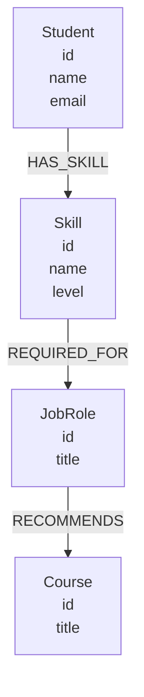

# SkillPath — Graph Database Career Explorer

SkillPath is a graph-powered web application that helps students explore suitable career paths based on their existing technical skills.

The application uses **CognoDB** as the graph database, **Spring Boot** for the backend, the **official Neo4j Java Driver** for database access, and HTML/CSS/JavaScript for the web interface.

---

## 1. Use Case

Students often have several technical skills but may not know which career roles those skills can lead to or what they should learn next.

SkillPath models the connections between:

- Students
- Skills
- Job Roles
- Courses

A student can select their profile and explore career roles connected to their skills and the courses recommended for those roles.

The main graph traversal is:

**Student → Skill → Job Role → Course**

### Example

Rahul has the following skills:

- Java
- Spring Boot
- SQL

These skills connect Rahul to the:

**Java Backend Developer**

role, which recommends:

**Spring Boot Masterclass**

---

## 2. Why a Graph Database?

A graph database is a natural fit for SkillPath because the important part of the application is the **connections between entities**, rather than isolated records.

The application needs to traverse relationships such as:

**Student → Skill → Job Role → Course**

For example, a recommendation can be found by starting from a student, following their skills, finding job roles requiring those skills, and then finding courses recommended for those roles.

In a relational database, these connections would require several tables and JOIN operations.

In a graph database, the relationships are represented directly as typed relationships between connected nodes, making relationship-oriented traversal more natural and easier to express with Cypher.

---

## 3. Graph Data Model

SkillPath uses the following graph model:



### Nodes

#### Student

Properties:

- `id`
- `name`
- `email`

#### Skill

Properties:

- `id`
- `name`
- `level`

#### JobRole

Properties:

- `id`
- `title`

#### Course

Properties:

- `id`
- `title`

### Relationships

| Relationship | From | To |
|---|---|---|
| `HAS_SKILL` | Student | Skill |
| `REQUIRED_FOR` | Skill | JobRole |
| `RECOMMENDS` | JobRole | Course |

---

## 4. Seed Data

The project contains realistic sample data for demonstrating the graph.

### Students

| ID | Name | Email |
|---|---|---|
| S001 | Rahul | rahul@example.com |
| S002 | Priya | priya@example.com |
| S003 | Arjun | arjun@example.com |

### Skills

| ID | Skill | Level |
|---|---|---|
| SK001 | Java | Intermediate |
| SK002 | Spring Boot | Intermediate |
| SK003 | SQL | Intermediate |
| SK004 | React | Beginner |
| SK005 | Docker | Beginner |

### Job Roles

| ID | Role |
|---|---|
| R001 | Java Backend Developer |
| R002 | Full Stack Developer |
| R003 | DevOps Engineer |

### Courses

| ID | Course |
|---|---|
| C001 | Spring Boot Masterclass |
| C002 | React Fundamentals |
| C003 | Docker for Developers |

The reproducible seed script is:

```text
src/main/resources/seed.cypher
```

The application also provides a development seed endpoint:

```text
POST /api/seed
```

---

## 5. Cypher Queries

The project's main Cypher queries are stored in:

```text
src/main/resources/queries.cypher
```

### Get all students

```cypher
MATCH (s:Student)
RETURN
    s.id AS id,
    s.name AS name,
    s.email AS email
ORDER BY s.name;
```

### Get skills for a student

```cypher
MATCH (s:Student {id: $studentId})
      -[:HAS_SKILL]->(skill:Skill)
RETURN
    skill.id AS id,
    skill.name AS name,
    skill.level AS level
ORDER BY skill.name;
```

### Career recommendation

```cypher
MATCH (s:Student {id: $studentId})
      -[:HAS_SKILL]->(skill:Skill)
      -[:REQUIRED_FOR]->(role:JobRole)
      -[:RECOMMENDS]->(course:Course)

RETURN
    s.name AS student,
    role.title AS role,
    collect(DISTINCT skill.name) AS skills,
    collect(DISTINCT course.title) AS courses
ORDER BY role.title;
```

The recommendation query performs a **multi-hop traversal**:

```text
Student
   ↓ HAS_SKILL
Skill
   ↓ REQUIRED_FOR
JobRole
   ↓ RECOMMENDS
Course
```

This demonstrates why the graph structure is useful for the application's use case.

All application queries use parameters such as:

```text
$studentId
```

rather than concatenating user input directly into Cypher.

---

## 6. Technology Stack

### Backend

- Java 21
- Spring Boot
- Spring Web
- Official Neo4j Java Driver
- Maven

### Database

- CognoDB
- openCypher
- Bolt protocol

### Frontend

- HTML
- CSS
- JavaScript

### Development Environment

- Eclipse IDE
- Insomnia for API testing

---

## 7. Application Architecture

```text
                  Web Browser
                       |
                       | HTTP
                       v
              Spring Boot Application
                       |
              ---------------------
              |                   |
              v                   v
         REST Controllers      Static UI
              |
              v
          GraphService
              |
              v
        GraphRepository
              |
              v
            CognoDB
```

The application follows a layered structure:

```text
Controller
    ↓
Service
    ↓
Repository
    ↓
CognoDB
```

---

## 8. Project Structure

```text
skillpath-backend
│
├── src
│   ├── main
│   │   ├── java
│   │   │   └── com.skillpath
│   │   │       ├── config
│   │   │       ├── controller
│   │   │       │   ├── RecommendationController.java
│   │   │       │   ├── SeedController.java
│   │   │       │   └── StudentController.java
│   │   │       │
│   │   │       ├── exception
│   │   │       │   └── GlobalExceptionHandler.java
│   │   │       │
│   │   │       ├── repository
│   │   │       │   └── GraphRepository.java
│   │   │       │
│   │   │       └── service
│   │   │           └── GraphService.java
│   │   │
│   │   └── resources
│   │       ├── static
│   │       │   ├── index.html
│   │       │   ├── script.js
│   │       │   └── style.css
│   │       │
│   │       ├── application.properties
│   │       ├── seed.cypher
│   │       └── queries.cypher
│   │
│   └── test
│
├── screenshots
│   ├── 01-main-ui.png
│   ├── 02-student-dropdown.png
│   ├── 03-recommendation.png
│   └── 04-second-recommendation.png
│
├── README.md
├── pom.xml
└── .gitignore
```

---

## 9. CognoDB Setup

SkillPath uses CognoDB as its graph database.

### Create a CognoDB instance

1. Create/sign in to a CognoDB Cloud account.
2. Create a free CognoDB instance.
3. Select an available region.
4. Copy the generated Bolt connection URI.
5. Save the generated username and password securely.

The application connects using the official Neo4j Java Driver.

The connection uses the Bolt URI supplied by CognoDB.

---

## 10. Environment Variables

Database credentials are loaded from environment variables.

The application expects:

```text
COGNODB_URI
COGNODB_USERNAME
COGNODB_PASSWORD
```

The `application.properties` file contains:

```properties
spring.application.name=skillpath-backend

cognodb.uri=${COGNODB_URI}
cognodb.username=${COGNODB_USERNAME:cognodb}
cognodb.password=${COGNODB_PASSWORD}
```

The real database password must never be committed to GitHub.

---

## 11. Loading the Seed Data

The repository contains:

```text
src/main/resources/seed.cypher
```

The seed script creates:

- Student nodes
- Skill nodes
- JobRole nodes
- Course nodes
- `HAS_SKILL` relationships
- `REQUIRED_FOR` relationships
- `RECOMMENDS` relationships

The script uses `MERGE` for reproducible loading without intentionally creating duplicate nodes or relationships.

---

## 12. REST API

### Get Students

```http
GET /api/students
```

Returns available students for the application.

### Get Student Skills

```http
GET /api/students/{studentId}/skills
```

Example:

```http
GET /api/students/S001/skills
```

Returns the skills connected to the selected student.

### Get Career Recommendations

```http
GET /api/recommendations/{studentId}
```

Example:

```http
GET /api/recommendations/S001
```

Traverses the graph to find connected career roles and recommended courses.

### Seed Data

```http
POST /api/seed
```

Creates the sample graph data used by the application.

---

## 13. Web Application

SkillPath provides a web interface that can be used by a non-technical user.

The user can:

1. Open the SkillPath application.
2. Select a student from the dropdown.
3. Click **Find Career Paths**.
4. View the student's connected skills.
5. View suitable career roles.
6. View recommended courses.

The UI includes:

- Student selection dropdown
- Career recommendation results
- Skills information
- Recommended courses
- Loading state
- Empty state
- Error state
- Retry interaction

---

## 14. Error Handling

The backend includes:

```text
GlobalExceptionHandler.java
```

which provides centralized REST error handling.

When an unexpected backend/database error occurs, the API returns a controlled error response instead of exposing internal implementation details.

The frontend also displays an appropriate error state and allows the user to retry the operation.

---

## 15. Running the Application

### Requirements

- Java 21
- Maven
- CognoDB instance
- Internet connection for the hosted database

### Configure environment variables

Set:

```text
COGNODB_URI=<your CognoDB Bolt URI>
COGNODB_USERNAME=<your CognoDB username>
COGNODB_PASSWORD=<your CognoDB password>
```

Do not commit the real password.

### Run from Eclipse

Open the project in Eclipse and run:

```text
SkillpathBackendApplication.java
```

The application runs on:

```text
http://localhost:8080
```

Open the URL in a browser to use the web application.

---

## 16. Screenshots

### Main Interface


### Student Dropdown


### Career Recommendation


### Second Recommendation


---

## 17. Hosted Application Demo

**Live Demo:**  

_To be added after deployment._

---

## 18. Screen Recording

**Application Walkthrough:**  

_To be added after recording._

---

## 19. Project Summary

SkillPath demonstrates how a graph database can be used to model and traverse relationships between students, skills, career roles, and learning resources.

The application's core graph is:

```text
Student
   ↓ HAS_SKILL
Skill
   ↓ REQUIRED_FOR
JobRole
   ↓ RECOMMENDS
Course
```

The project demonstrates:

- Graph data modeling
- Typed relationships
- Graph traversal
- Parameterized Cypher
- Official Neo4j Java Driver usage
- REST APIs
- Web UI
- Database error handling
- Environment-based configuration
- Reproducible seed data